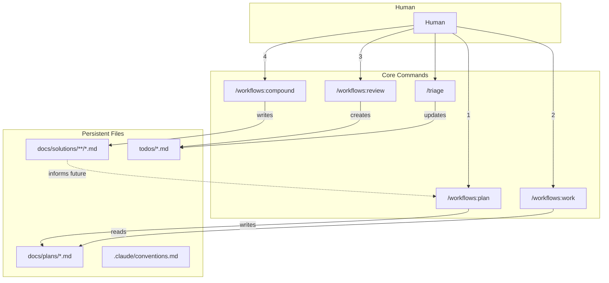
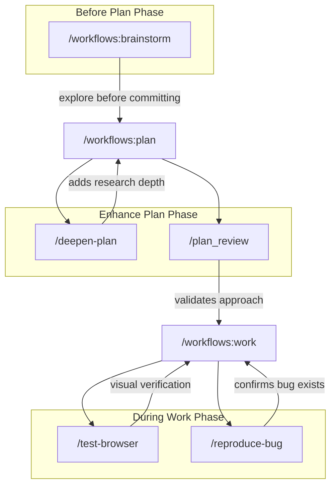
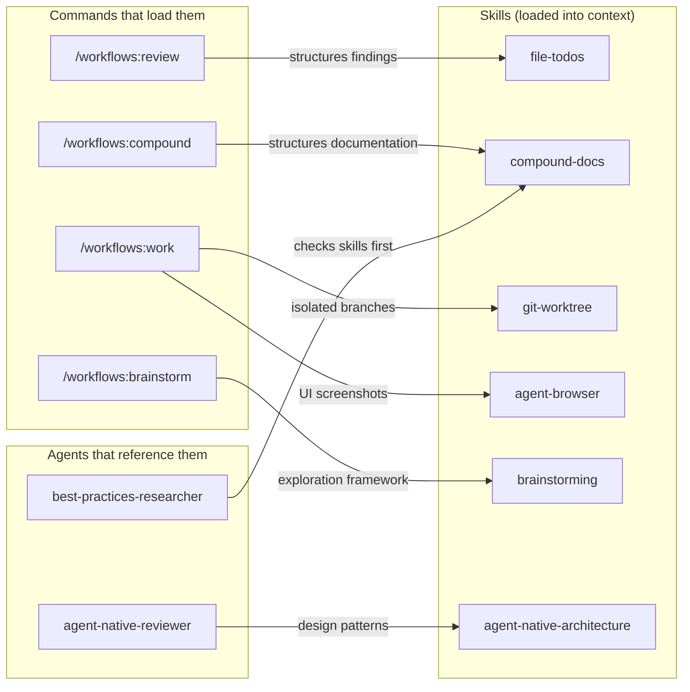
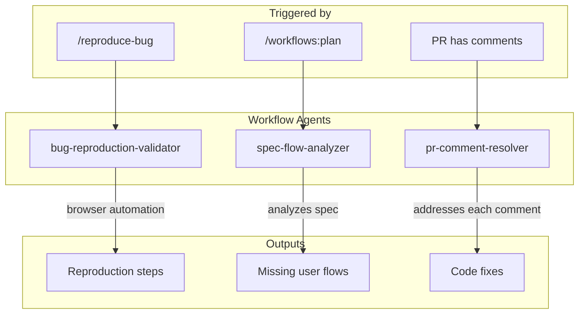
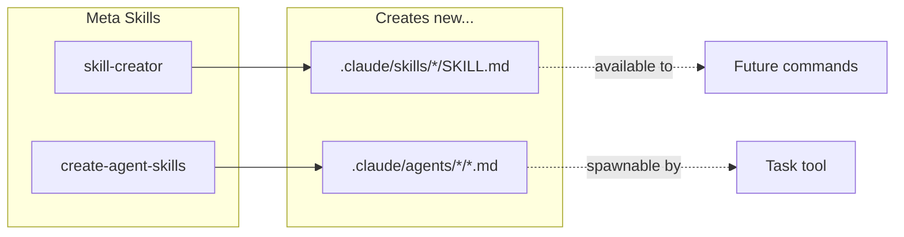
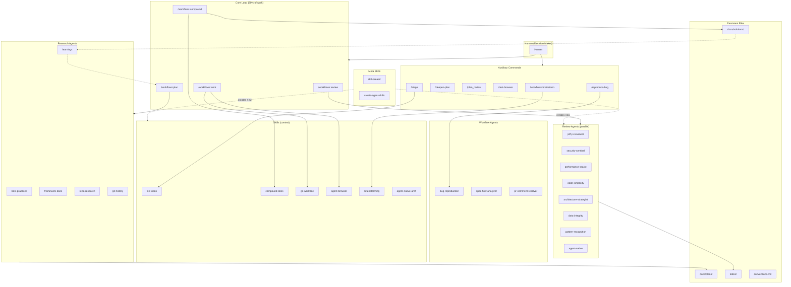
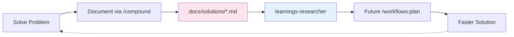

# Compound Engineering Architecture

## Main Workflow Loop

---

## Auxiliary Commands (Outside Main Loop)

These commands support the main workflow but aren't part of the core 4-phase loop:

| Command | When | Why |
|---------|------|-----|
| `/workflows:brainstorm` | Before planning | Explore requirements when scope is unclear |
| `/deepen-plan` | After initial plan | Add research depth to each section via parallel agents |
| `/plan_review` | Before starting work | Validate plan with reviewer agents |
| `/test-browser` | During/after work | Visual regression testing with browser automation |
| `/reproduce-bug` | Before fixing | Confirm bug exists, capture reproduction steps |

---

## Skills: When They Load

Skills are instruction sets that load into context automatically when relevant. They don't run independently—they augment commands and agents.

| Skill | Loaded by | Purpose |
|-------|-----------|---------|
| `file-todos` | `/workflows:review`, `/triage` | Template and conventions for todo files |
| `compound-docs` | `/workflows:compound` | Template for solution documentation |
| `git-worktree` | `/workflows:work` | Isolated branch workflows |
| `agent-browser` | `/workflows:work`, `/test-browser` | Browser automation CLI reference |
| `brainstorming` | `/workflows:brainstorm` | Structured exploration framework |
| `agent-native-architecture` | `agent-native-reviewer`, research agents | Agent-first design patterns |

---

## Workflow Agents (Not Reviewers)

These agents handle specific workflow tasks, not code review:

| Agent | Triggered by | Purpose |
|-------|-------------|---------|
| `bug-reproduction-validator` | `/reproduce-bug` | Systematically reproduce reported bugs |
| `spec-flow-analyzer` | `/workflows:plan` (on specs) | Find missing user flows and edge cases |
| `pr-comment-resolver` | Manual or parallel resolve | Address PR review comments automatically |

---

## Meta Components (Self-Modification)

These exist to create new skills and agents—extending the system itself:

| Skill | Purpose |
|-------|---------|
| `skill-creator` | Guide for creating new skills |
| `create-agent-skills` | Templates and best practices for agent definitions |

**Why these exist:** The system is designed to be self-extending. When you encounter a repeated pattern, you can create a skill or agent to handle it, which then becomes available to future workflows.

---

## Complete Component Map

---

## Component Types Summary

| Type | Count | Invocation | Persistence | Examples |
|------|-------|------------|-------------|----------|
| **Core Commands** | 5 | `/command` by human | — | `/workflows:plan`, `/workflows:review` |
| **Auxiliary Commands** | 5 | `/command` by human | — | `/deepen-plan`, `/test-browser` |
| **Review Agents** | 9 | `Task()` in parallel | — | `jeff-js-reviewer`, `security-sentinel` |
| **Research Agents** | 5 | `Task()` by plan phase | — | `learnings-researcher`, `framework-docs` |
| **Workflow Agents** | 3 | `Task()` by commands | — | `bug-reproduction-validator` |
| **Skills** | 8 | Auto-loaded by context | — | `file-todos`, `agent-browser` |
| **Meta Skills** | 2 | Manual for extension | — | `skill-creator` |
| **Files** | 4 types | Read/Write tools | ✓ Persistent | `todos/`, `docs/solutions/` |

---

## The Feedback Loop

**Each solved problem makes the next occurrence easier.**
